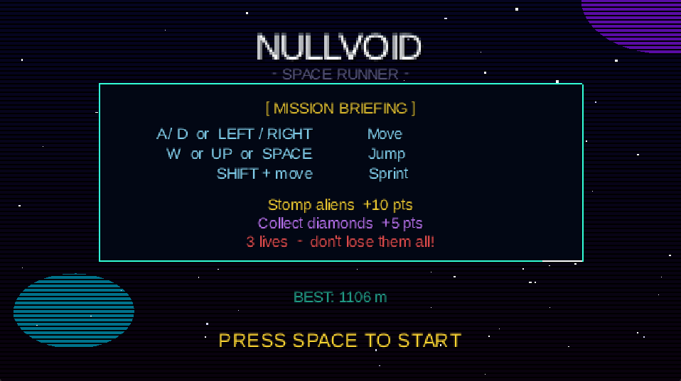
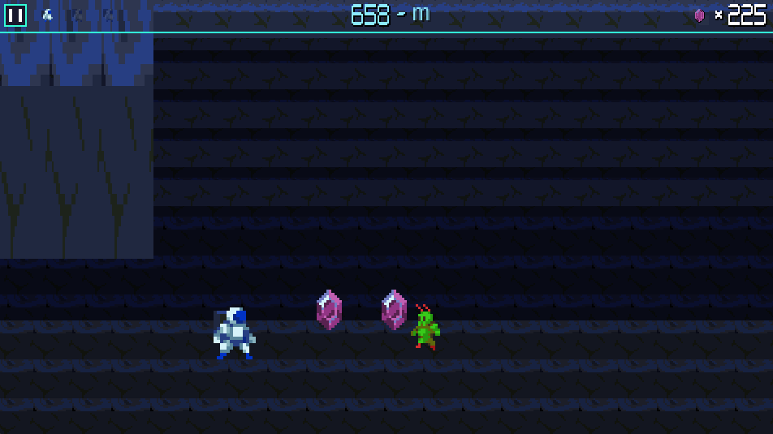
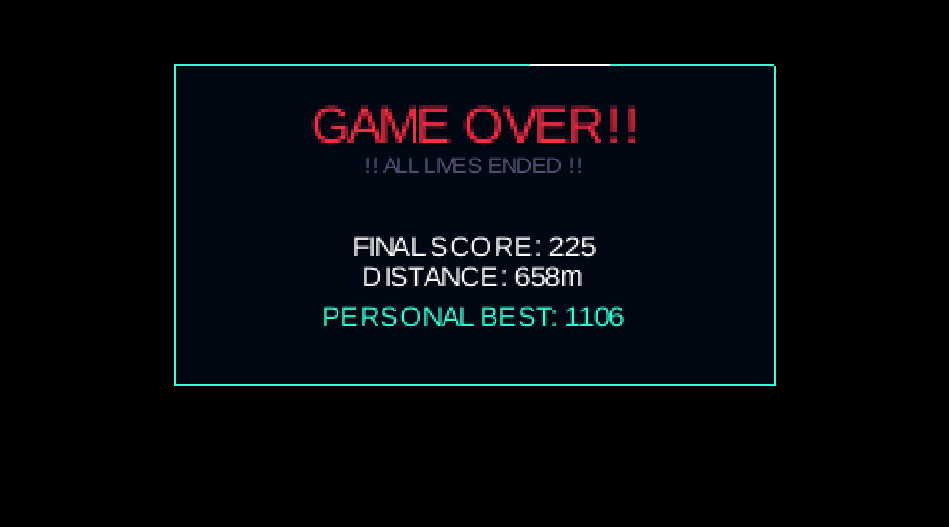

<div align="center">


# NULLVOID

**A pixel-art sci-fi endless runner built with LibGDX**


*Run. Jump. Stomp. Survive.*

</div>

---

## Screenshots

<div align="center">

| Menu | Gameplay | Game Over |
|:----:|:--------:|:---------:|
|  |  |  |

</div>

---

## About

NULLVOID is a pixel-art endless runner set in a hostile alien cave system. You play as an astronaut sprinting through a procedurally generated gauntlet of rocks, aliens, and ceiling hazards — collecting diamonds and stomping enemies to rack up the highest score before your three lives run out.

Built entirely from scratch in Java using the LibGDX framework, with hand-crafted pixel art assets, a custom sprite-based HUD, and a milestone-driven difficulty system that ramps up every 100 metres.

---

## Gameplay

| Action | Keys |
|--------|------|
| Move left / right | `A` / `D` or `←` / `→` |
| Jump | `W`, `↑`, or `Space` |
| Sprint | `Shift` + move |
| Pause / Resume | `Esc` or `P` |

### Scoring
- **Stomp an alien** — `+10 pts`
- **Collect a diamond** — `+5 pts`
- **Distance bonus** — added to final score on game over

### Lives & Difficulty
- You start with **3 lives** — losing all three ends the run
- Every **100 metres** a milestone is hit — speed increases and obstacles spawn faster
- Difficulty is tiered, not smooth — each threshold feels like a real step up

---

## Features

- Pixel-art HUD with sprite-based numbers, gem counter, and life icons
- Milestone banner system — "100m REACHED!" flash with speed bump on each threshold
- Score popups floating above stomped aliens and collected gems
- Pause screen with in-game mute toggle (setting persists between sessions)
- Background music loop + jump and gem collect SFX
- Procedural obstacle spawning with separation rules to prevent clustering
- Alien AI — walker and patrol types with rock avoidance
- Dynamic gem height — gems rise over rocks automatically
- Invincibility frames after taking a hit

---

## Project Structure

```
NULLVOID/
├── assets/               # All game assets (sprites, audio)
├── core/
│   └── src/main/java/com/nullvoid/
│       ├── NullVoid.java         # Entry point, game state machine
│       ├── GameWorld.java        # Physics, spawning, collision
│       ├── GameUI.java           # All rendering: HUD, menus, banner
│       ├── Player.java           # Player movement, animation, lives
│       ├── Alien.java            # Enemy AI (walker + patrol)
│       ├── MilestoneManager.java # Difficulty tiers, zone tracking
│       ├── AudioManager.java     # BGM loop, SFX, mute/persist
│       ├── InputHandler.java     # Keyboard input
│       ├── PixelFont.java        # Sprite-based HUD font renderer
│       └── ...                   # Rock, CeilingGap, Collectible, effects
├── desktop/              # Desktop launcher + fat JAR config
├── html/                 # GWT web target (WIP)
└── dist/                 # Release builds
```

---

## Building & Running

### Requirements
- Java 11 or higher
- Gradle (wrapper included — no install needed)

### Run from source
```bash
./gradlew :desktop:run          # Linux / macOS
.\gradlew.bat :desktop:run      # Windows
```

### Build a fat JAR
```bash
.\gradlew.bat :desktop:jar
java -jar desktop\build\libs\nullvoid-desktop.jar
```

### Build a Windows .exe + zip
```powershell
.\gradlew.bat :desktop:jar
jpackage --input desktop\build\libs --main-jar nullvoid-desktop.jar --name NULLVOID --app-version 1.1 --type app-image --dest dist
Compress-Archive -Path dist\NULLVOID -DestinationPath dist\NULLVOID_v1.1.zip
```

> `jpackage` requires JDK 14+. It bundles the JRE so the player doesn't need Java installed.

---

## Download & Play

1. Visit **[prasant-bhattarai.com.np](https://www.prasant-bhattarai.com.np/)**
2. Go to the **Projects** section
3. Select **N U L L V O I D**
4. Choose your preferred version
5. Download, play, and enjoy!

---

## Releases

| Version | Highlights |
|---------|-----------|
| v1.1 | Milestone system, difficulty tiers, BGM + SFX, mute toggle, pause button |
| v1.0 | Initial release — core gameplay, HUD, alien AI, score popups |

---

## Roadmap

- [ ] Android APK support with touch controls
- [ ] Screen shake on hit
- [ ] Zone-based map changes every 500m
- [ ] Sprint energy gauge
- [ ] Ceiling driller enemy (`SmallDriller.png`)
- [ ] Break effects using `GlassShards` / `RockShards` assets

---

## Credits

**Development** — solo project, built for learning and fun

**Assets** — pixel art and audio sourced from free / CC0 resources

**Engine** — [LibGDX](https://libgdx.com/) — cross-platform Java game framework

---

<div align="center">

**Developed by [Prasant Bhattarai](https://github.com/coprashant)**

*Made with ☕ + 🥟 and too many late nights*

</div>